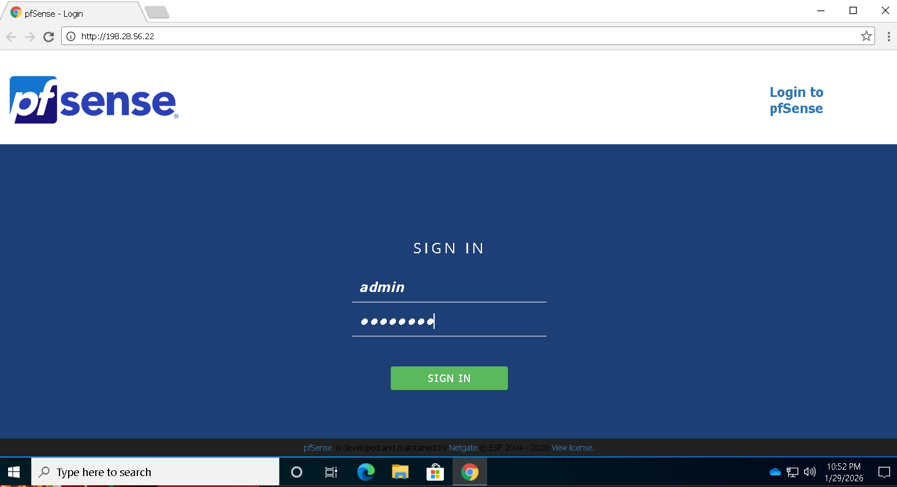
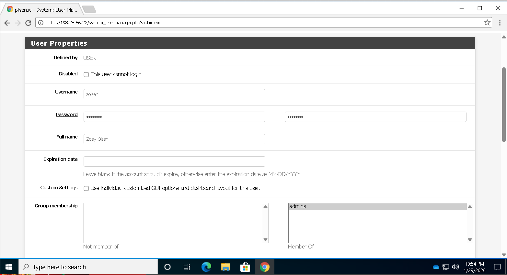
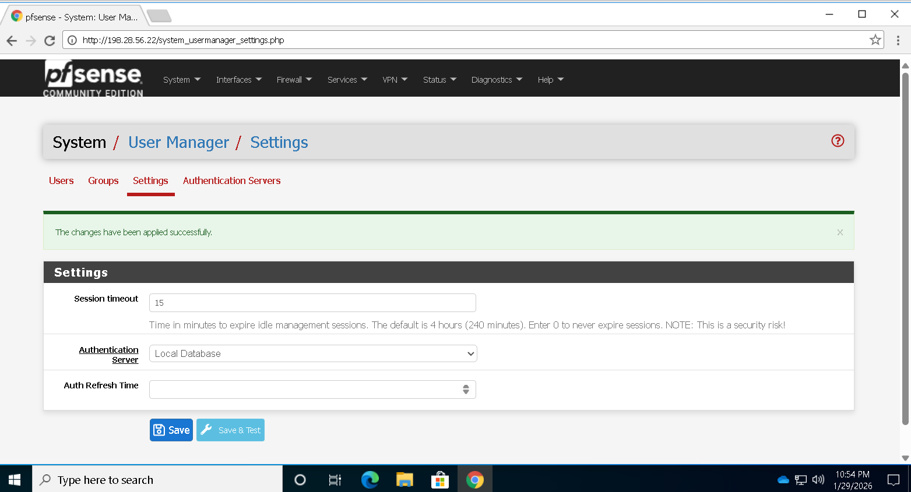
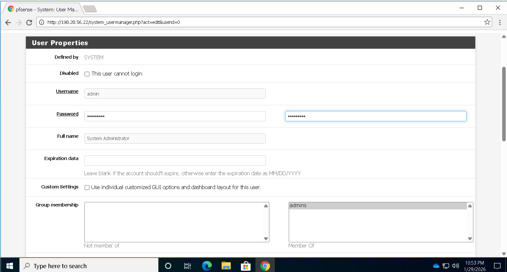
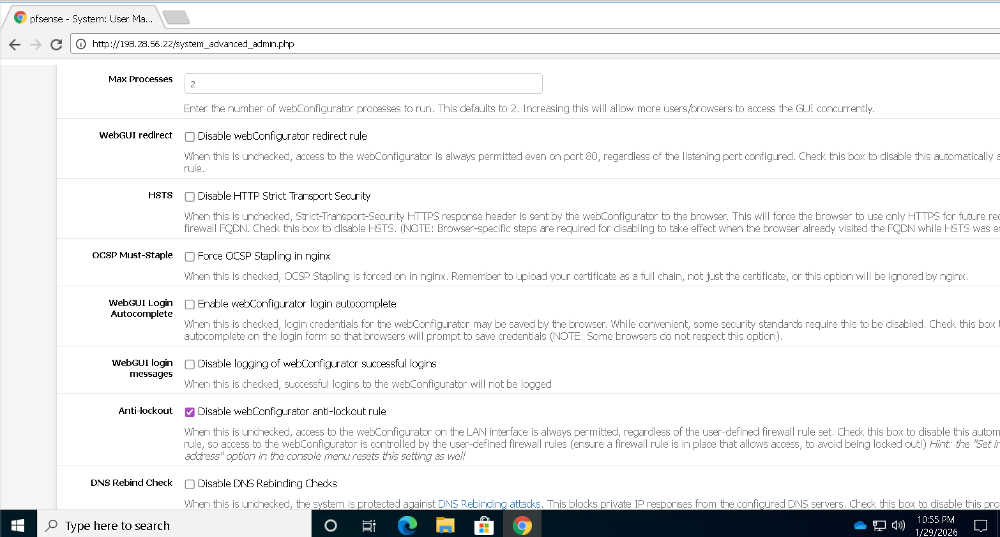
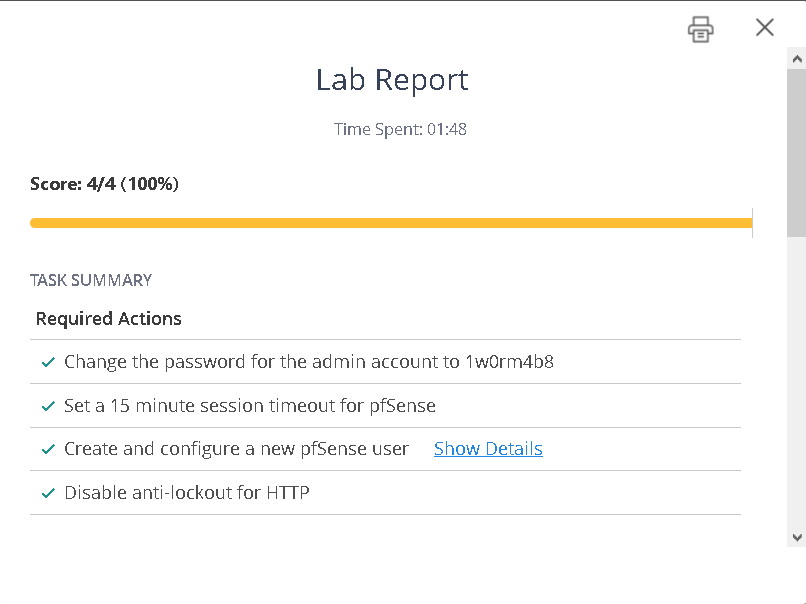

# 🔐 Lab : 5.2.8 Configure Network Security Appliance Access

---

##  โจทย์ 

Configure Network Security Appliance Access

คุณทำงานเป็นผู้ดูแลระบบความปลอดภัยด้านไอที (IT Security Administrator) สำหรับเครือข่ายองค์กรขนาดเล็ก
คุณจำเป็นต้องเพิ่มความปลอดภัยในการเข้าถึงอุปกรณ์ pfSense ซึ่งตอนนี้ยังคงใช้การตั้งค่าผู้ใช้เริ่มต้น (Default)
งานที่ต้องทำใน Lab นี้คือ

---

## 🛠️ ขั้นตอนที่ 1 :ที่อยู่เว็บไซต์ (URL): http://198.28.56.22/

### 1️⃣ ชื่อผู้ใช้เริ่มต้น (Username): admin รหัสผ่าน (Password): P@ssw0rd

---

### 2️⃣ สร้างผู้ดูแลระบบ (Administrative User) ใหม่`  
### Username: zolsen
### Password: St@yout!
### Full Name: Zoey Olsen
### Group Membership: admins

---

### 3️⃣ ตั้งค่า Session Timeout ของ pfSense
### ให้หมดเวลา (timeout) หลังจากไม่มีการใช้งานเป็นเวลา 15 นาที

---

### 4️⃣ เปลี่ยนรหัสผ่านของบัญชีผู้ใช้เริ่มต้น (admin)
### เปลี่ยนจาก P@ssw0rd
### เป็น 1w0rm4b8

---

### 5️⃣ ปิดกฎป้องกันการล็อกตัวเองออก (webConfigurator anti-lockout rule) สำหรับ HTTP

---

### 6️⃣ เสร็จ

###
🔹 ขั้นตอนที่ 1: เข้าสู่ระบบ pfSense

เริ่มต้นโดยเปิด Web Browser และเข้าไปยัง URL ที่กำหนด:

http://198.28.56.22/

จากนั้นทำการ Login ด้วยบัญชีเริ่มต้น ได้แก่:

Username: admin

Password: P@ssw0rd

การใช้บัญชีเริ่มต้นนี้ถือเป็นความเสี่ยงด้านความปลอดภัย เนื่องจากเป็นข้อมูลที่สามารถคาดเดาได้ง่าย ดังนั้นจึงจำเป็นต้องมีการเปลี่ยนแปลงในขั้นตอนถัดไป

🔹 ขั้นตอนที่ 2: สร้างผู้ดูแลระบบใหม่

เพื่อเพิ่มความปลอดภัยและลดการใช้งานบัญชี Default จึงทำการสร้างบัญชีผู้ดูแลระบบใหม่ โดยมีรายละเอียดดังนี้:

Username: zolsen

Password: St@yout!

Full Name: Zoey Olsen

Group Membership: admins

📌 เหตุผล

การสร้างผู้ใช้ใหม่ช่วยให้:

สามารถแยกสิทธิ์การใช้งานได้

ลดความเสี่ยงจากการใช้บัญชี Default

เพิ่มความสามารถในการตรวจสอบ (Audit)

🔹 ขั้นตอนที่ 3: ตั้งค่า Session Timeout

กำหนดค่า Session Timeout ของระบบ pfSense ให้หมดเวลาเมื่อไม่มีการใช้งานภายใน 15 นาที

📌 เหตุผล

ป้องกันการเข้าถึงระบบจากผู้ไม่หวังดี หากผู้ใช้งานลืม Logout

ลดความเสี่ยงจาก Session Hijacking

เพิ่มความปลอดภัยของระบบโดยรวม

🔹 ขั้นตอนที่ 4: เปลี่ยนรหัสผ่านบัญชี admin

ทำการเปลี่ยนรหัสผ่านของบัญชีเริ่มต้นจาก:

เดิม: P@ssw0rd

ใหม่: 1w0rm4b8

📌 เหตุผล

ป้องกันการถูกโจมตีด้วยข้อมูล Default

เพิ่มความแข็งแรงของรหัสผ่าน

ลดความเสี่ยงจากการเข้าถึงโดยไม่ได้รับอนุญาต

🔹 ขั้นตอนที่ 5: ปิด Anti-lockout Rule สำหรับ HTTP

ทำการปิดกฎ webConfigurator anti-lockout rule (HTTP)

📌 เหตุผล

เพื่อเพิ่มความเข้มงวดของ Firewall

ลดช่องโหว่ที่อาจถูกโจมตีผ่าน HTTP

บังคับให้ใช้งานผ่านช่องทางที่ปลอดภัยมากขึ้น เช่น HTTPS

⚠️ หมายเหตุ: การปิดกฎนี้ต้องมั่นใจว่าสามารถเข้าถึงระบบผ่านช่องทางอื่นได้ มิฉะนั้นอาจทำให้ไม่สามารถเข้าระบบได้

🔹 ขั้นตอนที่ 6: ตรวจสอบและบันทึกผล

หลังจากดำเนินการครบทุกขั้นตอน ให้ตรวจสอบว่า:

สามารถ Login ด้วยผู้ใช้ใหม่ได้

Session Timeout ทำงานถูกต้อง

รหัสผ่านใหม่ถูกนำมาใช้งานแล้ว

ระบบมีความปลอดภัยเพิ่มขึ้น

📊 ผลลัพธ์ที่ได้

จากการดำเนินการใน Lab นี้ พบว่า:

ระบบมีความปลอดภัยเพิ่มขึ้นอย่างชัดเจน

ลดความเสี่ยงจากการใช้ค่า Default

มีการควบคุม Session อย่างเหมาะสม

มีการจัดการผู้ใช้งานอย่างเป็นระบบ

🧠 สรุป

การตั้งค่าความปลอดภัยของ pfSense เป็นสิ่งสำคัญอย่างยิ่งในงานด้าน IT Security โดยเฉพาะการหลีกเลี่ยงการใช้ค่า Default และการกำหนดค่าที่เหมาะสม เช่น:

การสร้างผู้ใช้งานใหม่

การเปลี่ยนรหัสผ่าน

การตั้งค่า Session Timeout

การปรับแต่ง Firewall Rule

การดำเนินการเหล่านี้ช่วยลดความเสี่ยงจากภัยคุกคามทางไซเบอร์ และทำให้ระบบเครือข่ายมีความปลอดภัยมากยิ่งขึ้น
---
