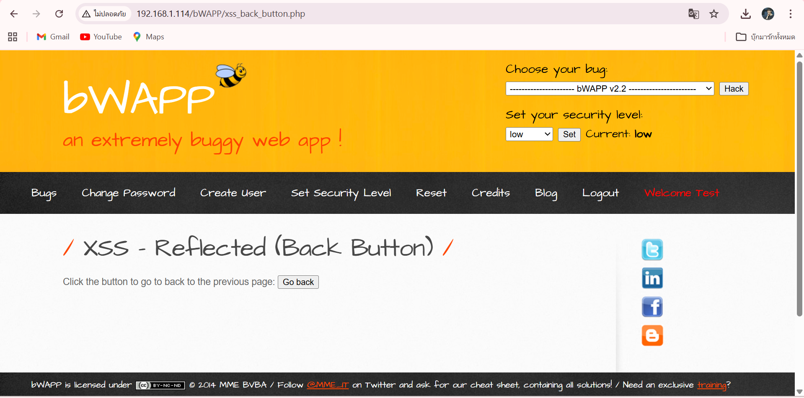
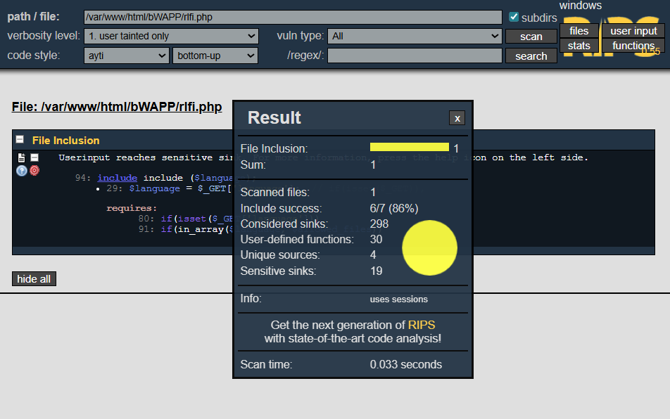
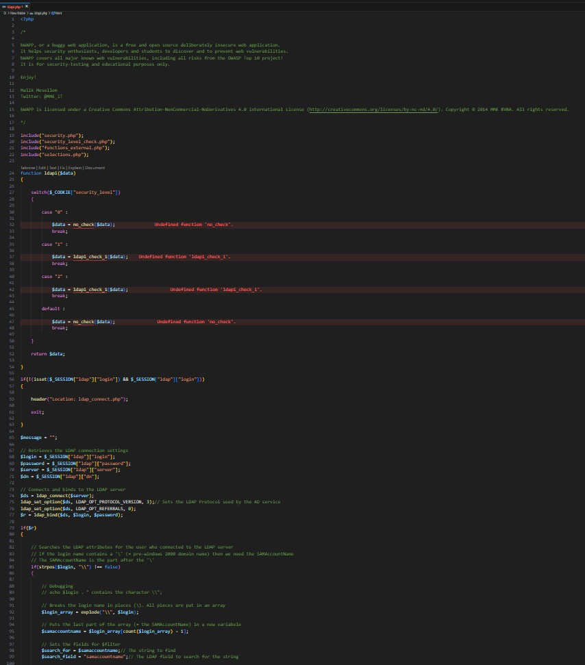
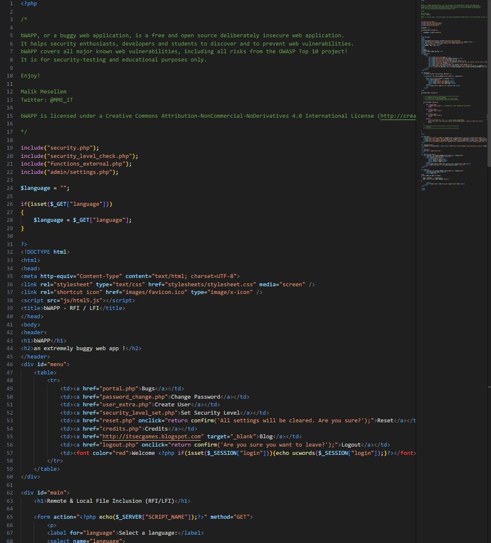
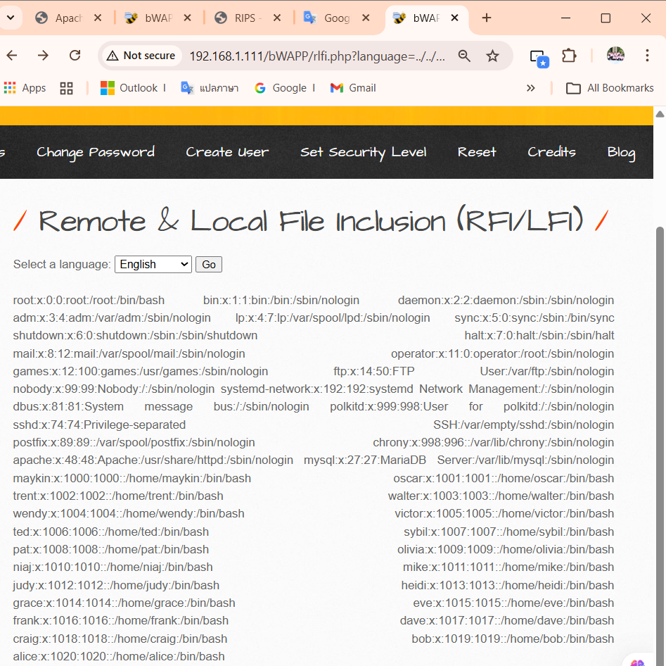
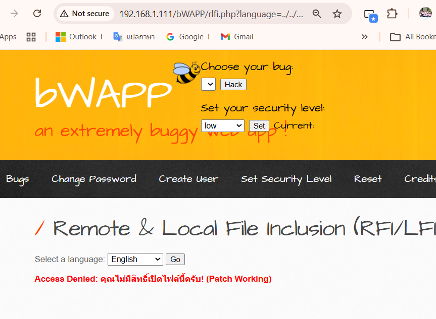
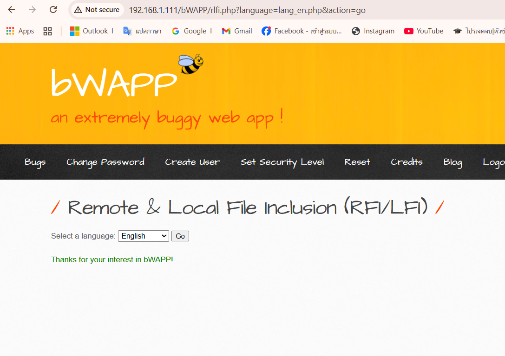

#  ___การจัดการช่องโหว่ Local File Inclusion (LFI)___ 
## เป้าหมาย: ไฟล์ rlfi.php ในระบบ bWAPP ระดับความยาก: ปานกลาง (Medium)


=== 

# 1. ฟังก์ชันการทำงานเดิม (Business Function)
### หน้านี้มีไว้ทำอะไร?

หน้านี้มีฟังก์ชันสำหรับ เลือกภาษา (Language Selection) เพื่อเปลี่ยนข้อความต้อนรับบนหน้าเว็บ

+ การทำงาน: ผู้ใช้เลือกภาษาจากเมนู (เช่น English, French) ระบบจะส่งชื่อไฟล์ (เช่น lang_en.php) ไปประมวลผล
+ สิ่งที่ควรจะเป็น: ระบบควรเปิดเฉพาะไฟล์ภาษาที่เตรียมไว้เท่านั้น
+ 


---

# 2. ช่องโหว่และการทดสอบ (Vulnerability & Payload)
### ปัญหาอยู่ที่บรรทัดไหน?

จากการสแกนด้วยเครื่องมือ RIPS พบว่าโค้ดมีการเขียนที่ไม่ปลอดภัย โดย RIPS แจ้งเตือนดังนี้


#### ผลการสแกน (RIPS Output)
> Userinput reaches sensitive sink
>> + 94: include($language); (จุดระเบิด/Sink)
>> + 29: $language = $_GET["language"]; (จุดรับเชื้อ/Source)
>> requires
>>> + 80: if(isset($_GET['language']))
>>> + 91: if(in_array($language, $allowed_files))

###  คำอธิบายปัญหา (Root Cause Analysis)
เราสามารถหลอกระบบให้ "เดินถอยหลัง" ออกจากโฟลเดอร์ปัจจุบันไปจนถึงรากของระบบ (Root) เพื่อขโมยไฟล์ความลับได้

+ บรรทัดที่ 29 (Source): ตัวแปร $language รับค่ามาจาก URL ($_GET) โดยตรง ซึ่งเป็นจุดที่แฮกเกอร์สามารถป้อนค่าอะไรก็ได้เข้ามา
+ บรรทัดที่ 91: แม้จะมีการตรวจสอบ in_array แต่ RIPS วิเคราะห์แล้วว่าการตรวจสอบนี้ "ไม่เพียงพอ" หรือ "ถูกบายพาสได้" ในบริบทนี้
+ บรรทัดที่ 94 (Sink): นี่คือจุดตาย! คำสั่ง include($language); นำค่าที่รับมาจากบรรทัดที่ 29 มาสั่ง เปิดไฟล์ทันที โดยไม่มีการกรองที่เด็ดขาด ทำให้เกิดช่องโหว่ Local File Inclusion

---

# 3. การพิสูจน์ช่องโหว่ (Exploitation)
### เจาะระบบได้อย่างไร?

เนื่องจากบรรทัดที่ 94 ยอมเปิดไฟล์ตามที่สั่ง เราจึงใช้เทคนิค Directory Traversal เพื่อถอยหลังออกจากโฟลเดอร์ปัจจุบันไปขโมยไฟล์ความลับ

+ Payload (สูตรโกง): ../../../../etc/passwd
+ การทำงาน: คำสั่ง ../ (ถอยหลัง) จำนวน 4 ครั้ง จะพาเราย้อนกลับไปถึงรากของระบบ (Root) และเข้าถึงไฟล์ /etc/passwd
+ ผลลัพธ์: หน้าเว็บแสดงข้อมูลรายชื่อผู้ใช้งานระบบ (User List) ออกมาทางหน้าจอ ยืนยันว่าช่องโหว่ใช้งานได้จริง

---

# 4.แนวทางการแก้ไข (Remediation)
### แก้ยังไงให้หายขาด?

เรายกเลิกวิธีการตรวจสอบแบบเดิม (บรรทัด 91) และเปลี่ยนมาใช้ระบบ Whitelist ผ่านคำสั่ง switch...case ซึ่งเป็นการระบุชื่อไฟล์ที่อนุญาตแบบ ตายตัว (Hardcoded)

```php
switch($_GET["language"]) {
    // ✅ อนุญาตเฉพาะไฟล์ที่เรารู้จักเท่านั้น
    case "lang_en.php":
        include("lang_en.php");
        break;
    case "lang_fr.php":
        include("lang_fr.php");
        break;
    case "lang_nl.php":
        include("lang_nl.php");
        break;
    
    // ❌ กรณีอื่นๆ (รวมถึง Payload ของแฮกเกอร์) จะถูกดีดมาที่นี่
    default:
        echo "<font color='red'>Access Denied</font>";
        break;
}
```
# โค้ดที่ยังไม่แก้ไข


# โค้ดที่แก้ไขแล้ว

---

# 5. การตรวจสอบหลังแก้ไข (Verification)
### แก้แล้วดีจริงไหม?

## 5.1 ตรวจสอบความปลอดภัย (Security Check)
ทดสอบยิง Payload เดิม ../../../../etc/passwd อีกครั้ง
+ ผลลัพธ์: ระบบแสดงข้อความ "Access Denied" สีแดง (ตามที่เราเขียนดักไว้ใน default) ไม่สามารถเข้าถึงไฟล์ความลับได้อีกต่อไป


## 5.2 ตรวจสอบคุณภาพโค้ด (RIPS Re-scan)
สแกนไฟล์ที่แก้แล้วด้วย RIPS อีกครั้ง
+ ผลลัพธ์: RIPS ขึ้นสถานะ "No vulnerabilities found" (ไม่พบช่องโหว่) แถบสีแดง/เหลืองหายไปทั้งหมด ยืนยันว่าโค้ดบรรทัดที่ 29 ถึง 94 ปลอดภัยแล้ว


## 5.3 ตรวจสอบการใช้งาน (Usability Check)
ทดสอบเลือกภาษา "English" จากหน้าเว็บปกติ
+ ผลลัพธ์: เว็บไซต์แสดงผลถูกต้อง (ข้อความต้อนรับภาษาอังกฤษ) ผู้ใช้งานทั่วไปยังใช้งานได้ตามปกติ


===

# สรุป :
การดำเนินการแก้ไขช่องโหว่ Local File Inclusion (LFI) บนระบบ bWAPP เสร็จสิ้นสมบูรณ์ การปรับปรุงโค้ดด้วยวิธี Strict Whitelisting สามารถขจัดความเสี่ยงจากการเข้าถึงไฟล์ระบบโดยไม่ได้รับอนุญาตได้ 100% โดยผ่านการตรวจพิสูจน์ทั้งในเชิงรุก (Exploitation) และเชิงรับ (Source Code Analysis) เรียบร้อยแล้ว ระบบมีความมั่นคงปลอดภัยพร้อมใช้งานตามปกติ
